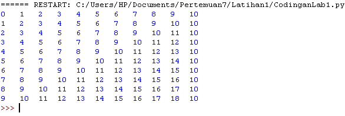
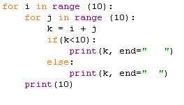
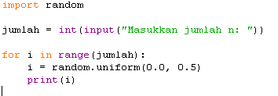
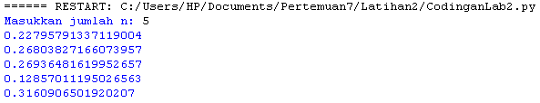

# Lab3

**Latihan1**

**JAWABAN**  
  
* Buka text editor, PyCharm, Atom, Visual Studio, dan lain-lain. Kemudian salin kode berikut :

`1 for i in range(10):`  
`2     for j in range(10):`  
`3         k = i + j`  
`4         if(k<10):`  
`5             print(k, end="   ")`  
`6         else:`  
`7             print(k, end="  ")`  
`8     print()`  
`9`

  

* Kemudian simpan dengan nama latihan1.py, lalu jalankan program tersebut. Maka akan menampilkan output sebagai berikut :  
  

**PENJELASAN**  
* Pada baris pertama dan ke dua program `lathan1.py`, terdapat fungsi `for` yang merupakan jenis perulangan yang terhitung / *cunted loop*.

* Variabel `i` dan `j` pada baris ke-1 dan 2 berfungsi untuk menampung indeks. Sedangkan fungsi `range(10)` berfungsi untuk membuat list antara 0 sampai 10.

* Pada baris ke-3 nilai dari variabel `i` ditambah dengan nilai dari variabel `j`. Kemudian disimpan pada variabel `k`.

* Baris ke-4 klausa `if` sebagai pemilihan kondisi, contohnya : "Jika nilai pada variabel `k` hasilnya **kurang dari 10**, maka jalankan baris ke-5 program.

* Dan di baris ke-5 merupakan lanjutan dari `if` . `print` untuk mencetak nilai dari variabel `k` ke layar, kemudian fungsi `end=" "` untuk memberi jarak/ spasi 3 kali ke kanan.

* Program berjalan dan terus melakukan looping. Namun jika perintah pada baris ke-4 tidak terpenuhi / nilai `k` **lebih besar dari 10**, Maka program akan lompat ke baris-6.

* Di baris ke-6 klausa `else` sebagai jalan terakhir apabila klausa `if` tidak terpenuhi.

* Baris ke-7 merupakan lanjutan dari `else` . `print` untuk mencetak nilai dari variabel `k` ke layar, kemudian fungsi `end=" "` untuk memberi jarak/ spasi 2 kali ke kanan.

* Baris ke-8, `print()` berfungsi apabila perulangan pertama pada variabel `i` telah dilakukan, maka tampilkan ke layar. contohnya

`0  1   2   3   4   5   6   7   8   9`

* Program akan terus melakukan looping dari baris pertama hingga ke-8, sampai nilai dari variabel `i` telah mencapai list ke-10.

 `0   1   2   3   4   5   6   7   8   9`
 `1   2   3   4   5   6   7   8   9  10`
 `2   3   4   5   6   7   8   9  10  11`
 `3   4   5   6   7   8   9  10  11  12`
 `4   5   6   7   8   9  10  11  12  13`
 `5   6   7   8   9  10  11  12  13  14`
 `6   7   8   9  10  11  12  13  14  15`
 `7   8   9  10  11  12  13  14  15  16`
 `8   9  10  11  12  13  14  15  16  17`
 `9  10  11  12  13  14  15  16  17  18`

 **LATIHAN2**  
   
**JAWABAN**  
* Buka text editor, PyCharm, Atom, Visual Studio, dan lain-lain. Kemudian salin kode berikut :  
`1   import random`  
`2`  
`3   jumlah = int(input("Masukkan jumlah n: "))`  
`4`  
`5   for i in range(jumlah):`  
`6       i = random.uniform(0.0, 0.5)`  
`7       print(i)`  
`8`

  
* Kemudian simpan dengan nama `latihan2.py`, lalu jalankan program tersebut. Maka akan menampilkan output sebagai berikut :

  

# PENJELASAN

* Pada baris pertama program `latihan2.py`, tertulis `import random` yang berarti kita meng-impor modul/ `library` bawaan dari python bernama **random**. Modul ini berisi bilangan acak, dengan bentuk **float**.

* Baris ke-3 mendeklarasikan `jumlah` sebagai variabel untuk menyimpan nilai/ jumlah yang akan kita masukkan nanti. Dan `int` merubah bentuknya yang sebelumnya *string* menjadi *integer*.

* Baris ke-5 `for` merupakan perulangan, dan `i` untuk menampung indeks. `range(jumlah)` sebagai list akan mengikuti jumlah yang kita masukkan pada baris ke-3.

* Baris ke-6, mendeklarasikan kembali variabel `i`, dan random.`uniform(0.0, 0.5)` untuk menampilkan nilai acak dari yang telah di tentukan, yaitu antara **0.0** sampai **80.5**

* Baris ke-7, `print(i)` untuk menampilkan nilai acak dari i di baris-6 ke layar.

* Kemudian program akan terus berulang sampai nilai dari **jumlah** yang kita inputkan tadi terpenuhi.